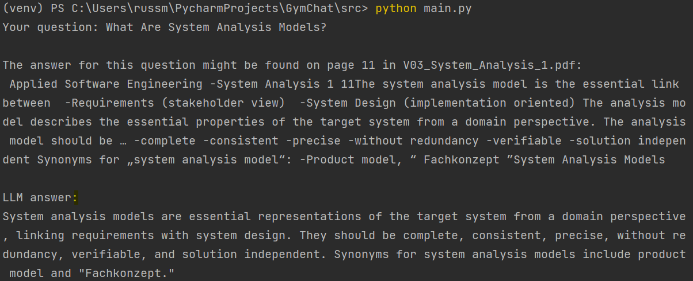

# Lecture Q&A

Let an LLM answer your open questions regarding the upcoming exam.

This Python application implements a Retrieval-Augmented Generation (RAG) pipeline from scratch. The application extracts text from lecture PDFs, preprocesses it, and uses embedding representations to find the most similar context to a user query. It then queries an OpenAI language model to provide an answer based on the retrieved context.

## Features

- Extracts text from lecture PDFs.
- Preprocesses the extracted text.
- Computes embeddings for the preprocessed text.
- Finds the most similar context for a given query.
- Queries an OpenAI language model to answer the query based on the retrieved context.

## Requirements

- Python 3.7+
- PyPDF2
- gensim
- numpy
- scikit-learn
- requests
- OpenAI Python client

## Installation

1. Clone the repository:

    ```bash
    git clone https://github.com/krussmann/LectureQA.git
    cd LectureQA
    ```

2. Install the required Python packages:

    ```bash
    pip install PyPDF2 gensim numpy scikit-learn requests openai
    ```

3. Set up your OpenAI API key:

    ```bash
    export openai_key='your-openai-api-key'
    ```

## Usage

1. Ensure that all lecture PDF files are placed in the `Pdfs` directory within the project directory.

2. Run the application:

    ```bash
    python main.py
    ```

3. Follow the prompt to input your question.


## Example
<details>   

<summary><kbd>CLICK</kbd> for an example</summary>
<p align="center">
  
</p>

</details>